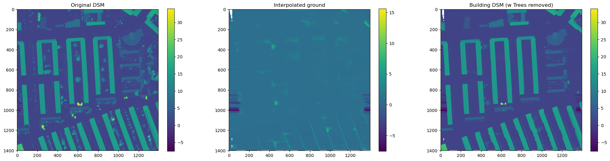
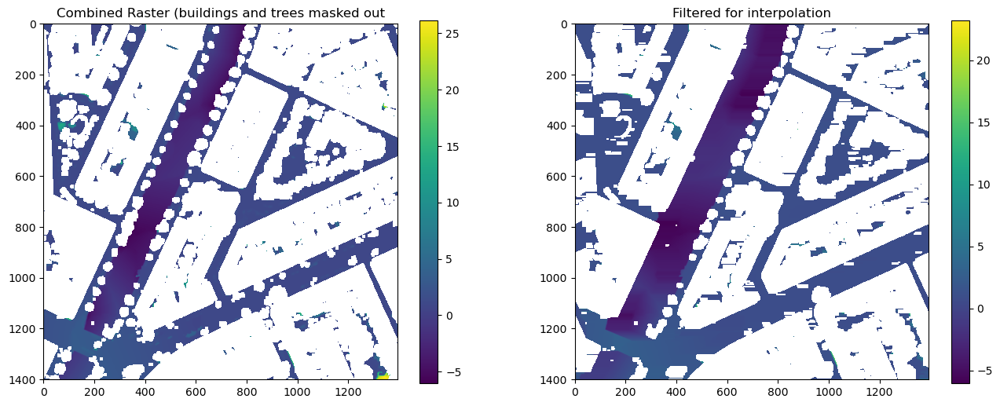

# Throwing Shade

Throwing Shade is a ongoing project dealing with shade simulation and shade analysis.

Contains ongoing work. __PLEASE KEEP FORKS PRIVATE, THANKS!__

## Installation

Use requirements.txt to install relevant packages

## Usage

### SolarAPI download
Not that important for now. 
Uses: Uses a geocode query to download administrative bounds. Creates query points for SolarAPI. Downloads respective files incrementally. 

Gives me:
- OSM_buildings
- Query points for API requests
- DSM
- RGB imagery
- building mask
- annual flux (depending on settings)

Relevant code:
file: download_solar_api.py

### Preprocessing

The UMEP plugin requires two inputs (if you want to include trees): 
- DSM 
- CHM

Requirement (due to data-sources): Process DSM into Building DSM and Canopy Height Model (CHM/Canopy DSM)

Dataflow: from data/clean_data/solar/{OSMID} to data/clean_data/solar/{OSMID}/rdy_for_processing

Relevant code: 
file: process_area_gilfoyle_parallel_multiple_days.py
function: process_raster

Steps:

- Use CHM generated via AHN as raster mask (data/clean_data/chm) -> Canopy DSM

(See 230921_Tree_Segmentation_multiple_tiles.R for AHN processing script (uses LidR package, thus written in R))

Fill in missing ground values.

- Mask out buildings and trees from DSM -> prepare for interpolation 

- Interpolate using startinpy, add buildings and save newly created Building DSM

### Shadowcasting

UMEP Shadow Pattern as standalone implementation.

NOTE: For my research I'm running the shade simulation twice. 1st run with buildings only, 2nd run with buildings and trees. One of the things I'm working on is the difference between building and tree shade, so I require both. 

Execution in parallel, for multiple days.

Results (see results folder): 
- shade raster per timestep
- shade raster for daily shading. 
for both buildings only (passing only the building DSM to the function) and buildings and trees (including both buildings and trees)

You'll have to untangle this. 

Relevant code:
file: process_area_gilfoyle_parallel_multiple_days.py
function: shade_processing

links to
- shade_setup.py
- shadowingfunctions.py
- sun_position.py

### Other noteworthy code:

- shade_metrics_on_graph.ipynb: notebook with the code to calculate shade_weights per edge in a network graph. 

- calculate_shade_metrics_all.py: calculate shade metrics on polygons of public space (hard surfaces).

- 230921_Tree_Segmentation_multiple_tiles.R: Tree segmentation from AHN (results in CHM + tree crown polygons)

- tree_detection_segmentation.ipynb: exploration of tree detection + segmentation workflow using DeepForest + SAM. Only relevant for scaling up to contexts outside NL (where AHN is not available)

- momepy_importance.ipynb: Exploration of using multiple centrality assessment (from momepy) to identify the most important edges in a network

- 240912_Download_SolarAPI.ipynb: Example flow of SolarAPI download. You likely don't need to use this at all. 

IGNORE ARCHIVE AND ANALYSIS FOLDERS

### folder structure:

- code: All scripts etc.

- data
    - clean_data
        - solar
            - {OSMID}: Contains solarAPI downloads - DSM + RGB (+ annual flux, if requested) 
        - chm
            {SUBTILE}.tif / .gpkg. Use tif rather than gpkg, polygonise creates random artefacts

- results
    - figures
    - output
        - {OSMID}
            - building_shade
            - tree_shade
                - {point_id}
                    - {OSMID}_{point_id}_Shadow_{DATE}_{TIME}_LST.tif
                    - {OSMID}_{point_id}_shadow_fraction_on_{DATE}.tif

## Contributing

## License
